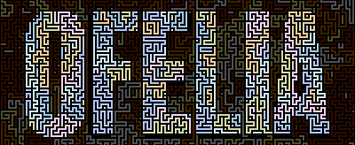
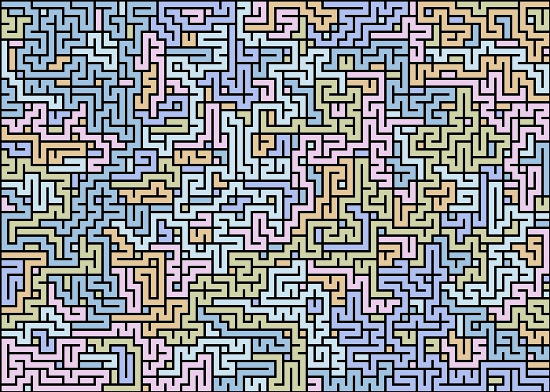
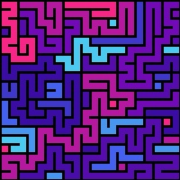
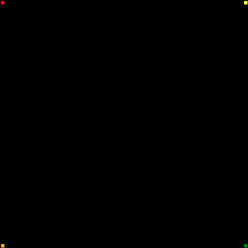

# Ofelia
 


 A python script to generate _not mazes_, but look-alikes. The idea came from my daughter, the code from me. It's a very early code, with 1-hour work total. It still needs to be optimized, improved, enhanced. And we got ideas.

 The name comes from the movie **The Pan's Labyrinth**. The main character is named Ofelia. Also, I like recursive acronyms, so it stands for _Ofelia Fabrique d'Étonnants Labyrinthes et d'Incroyables Architectures_, which is french (cause I'm french). It could translates to _Ofelia makes stunning labyrinths and incredible architectures_ (which is not a recursive acronym anymore).



This is what Ofelia can generate. And I'll explain soon what are the rules/behaviour.

## How to use

Right now, the code is kinda _as is_, and I plan to work on making it more user friendly (so my daughter can more easily play with it). You can look at the two generators.

You can also get to [see some examples](examples.md).

### Console generation

Open the `testConsole.py` script. There, you can change the size of the maze you generate, and state the starting points. Then, you display it. The `colored` argument is there as a test to colorize the output (but it's kind of meh).

```
displayCharPath(maze, colored=True)
```

It generates something like this : 

```
a a g e e e a a a c
e e e e e e k m n c
b b h j e e k k c c
b b h j h h h h c c
b b h h h i i i c c
b b i i i i l l c c
b b f f d d d d d o
b f f f d d d d d p
b f f f d d d d d d
```

### Image generation

Open the `testPIL.py` script. As noted in the file, it uses the PIL image generation library. You need it to run it.

You'll find three fillings of the `colors` table. Only the last one is used (previous were tests with my daughter). This is one the stuff I need to improve. But, for your own tests, fill that table with the colors you want for your image.

```
xMax = 100
yMax = 100
maze = mazePlane.mazePlane(xMax, yMax)
maze.addPath(0, 0)
maze.addPath(0, yMax - 1)
maze.addPath(xMax - 1, 0)
maze.addPath(xMax - 1, yMax - 1)

print("## Building...")
while maze.expandOneStep():
    pass

print("## Drawing...")
drawMaze(maze)
```

This is the generation code : setting the size, the starting points, then building the maze (cost sensitive with those parameters), and drawing it. A jpg file is generated. Voilà!



Want to see how the maze is constructed?


