# Some examples of generated images

All those gif have been generated by the script [src/generation_examples.py].

Some initialization, with a standard color manager, and some size specification : 

```
colors = colMg.colorManager(colors=colMg._PASTELS_PALETTE)
xMax = 25
yMax = 25
cell_size = 4
path_size = 2
```

The `NONE` new path policy does nothing : no new path is created after the original ones are drawn.

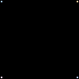
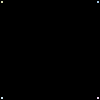

```
# Only one
maze = plane.mazePlane(xMax, yMax, new_path_policy=plane.NewPathPosition.NONE)
maze.add_path((0, 0), starting=True)
maze.add_path((0, yMax - 1), starting=True)
maze.add_path((xMax - 1, 0), starting=True)
maze.add_path((xMax - 1, yMax - 1), starting=True)
vis.draw_maze_gif(maze, frame_duration=30, loop=None, image_filename='./examples/none.gif', \
                  colors=colors, cell_size=cell_size, path_size=path_size)
maze.reset()
vis.draw_maze_gif(maze, frame_duration=30, loop=0, image_filename='./examples/none_loop.gif', \
                  colors=colors, cell_size=cell_size, path_size=path_size)
```

With the `LEFT_THEN_TOP` policy, the new paths are created in the first available position, starting left then top.

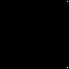
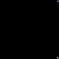

```
# Near first origin
maze = plane.mazePlane(xMax, yMax, new_path_policy=plane.NewPathPosition.LEFT_THEN_TOP)
maze.add_path((xMax - 1, 0), starting=True)
maze.add_path((xMax - 1, yMax - 1), starting=True)
vis.draw_maze_gif(maze, frame_duration=30, loop=None, image_filename='./examples/leftthentop.gif', \
                  colors=colors, cell_size=cell_size, path_size=path_size)
maze.reset()
vis.draw_maze_gif(maze, frame_duration=30, loop=0, image_filename='./examples/leftthentop_loop.gif', \
                  colors=colors, cell_size=cell_size, path_size=path_size)
```

The `NEAR_TRUE_ORIGIN` policy will look to the origin of the first path (in a series of path), and will find the nearest available position.

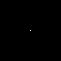


```
# Near first origin
maze = plane.mazePlane(xMax, yMax, new_path_policy=plane.NewPathPosition.NEAR_TRUE_ORIGIN)
maze.add_path((int(xMax / 2), int(yMax / 2)), starting=True)
vis.draw_maze_gif(maze, frame_duration=30, loop=None, image_filename='./examples/neartrueorigin.gif', \
                  colors=colors, cell_size=cell_size, path_size=path_size)
maze.reset()
vis.draw_maze_gif(maze, frame_duration=30, loop=0, image_filename='./examples/neartrueorigin_loop.gif', \
                  colors=colors, cell_size=cell_size, path_size=path_size)
```

The `NEAR_PREVIOUS` policy will look for the available position near the start of the previous path.

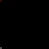
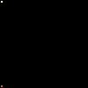

```
# Near previous position
maze = plane.mazePlane(xMax, yMax, new_path_policy=plane.NewPathPosition.NEAR_PREVIOUS)
maze.add_path((0, 0), starting=True)
maze.add_path((0, yMax - 1), starting=True)
vis.draw_maze_gif(maze, frame_duration=30, loop=None, image_filename='./examples/nearprevious.gif', \
                  colors=colors, cell_size=cell_size, path_size=path_size)
maze.reset()
vis.draw_maze_gif(maze, frame_duration=30, loop=0, image_filename='./examples/nearprevious_loop.gif', \
                  colors=colors, cell_size=cell_size, path_size=path_size)
```

The `FULL_RANDOM` policy will let randomness choose a new start.

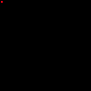
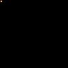

```
# Full random
maze = plane.mazePlane(xMax, yMax, new_path_policy=plane.NewPathPosition.FULL_RANDOM)
maze.add_path((0, 0), starting=True)
vis.draw_maze_gif(maze, frame_duration=30, loop=None, image_filename='./examples/fullrandom.gif', \
                  colors=colors, cell_size=cell_size, path_size=path_size)
maze.reset()
vis.draw_maze_gif(maze, frame_duration=30, loop=0, image_filename='./examples/fullrandom_loop.gif', \
                  colors=colors, cell_size=cell_size, path_size=path_size)
```

You can set up a mask with a white/black jpg image to use as a mask. Black areas will be avoided by the paths.

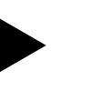
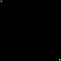
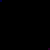

```
# With a mask
testMask = mask.mask()
testMask.set_mask_from_image(image='./examples/mask_example.jpg', square_size=(cell_size, cell_size))
maze = plane.mazePlane(xMax, yMax, new_path_policy=plane.NewPathPosition.NEAR_TRUE_ORIGIN, mask=testMask)
maze.add_path((0, 0), starting=True)
maze.add_path((xMax - 1, yMax - 1), starting=True)
vis.draw_maze_gif(maze, frame_duration=30, loop=None, image_filename='./examples/mask.gif', \
                  colors=colors, cell_size=cell_size, path_size=path_size)
maze.reset()
vis.draw_maze_gif(maze, frame_duration=30, loop=0, image_filename='./examples/mask_loop.gif', \
                  colors=colors, cell_size=cell_size, path_size=path_size)
```
